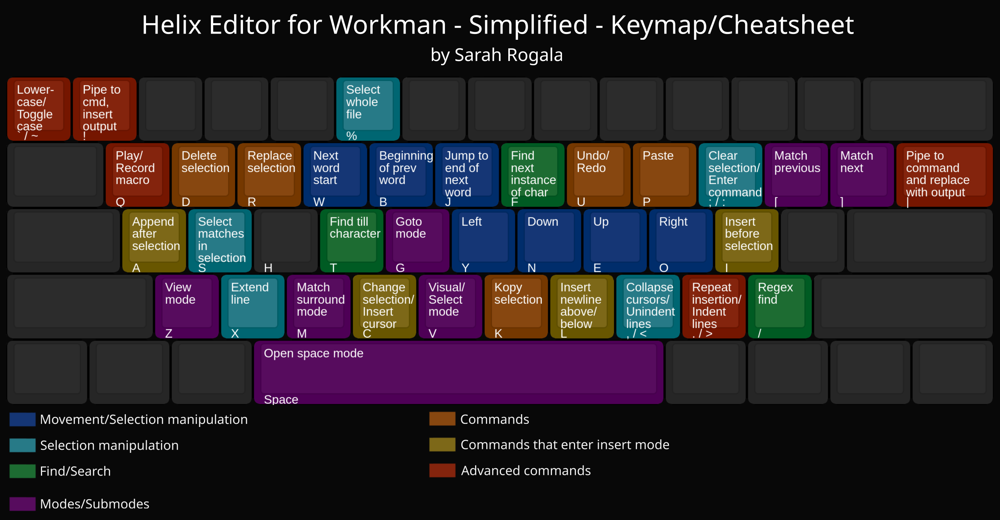
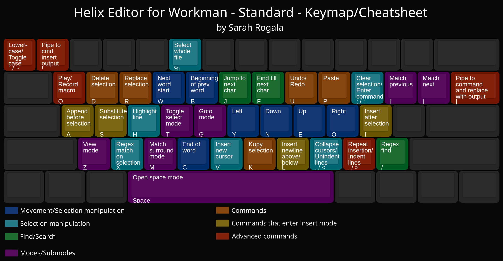

# Helix Config Files for the Workman Keyboard Layout
## The Simplified Config

This layout has been modified from the standard config to contain as few changes from the Helix defaults as possible. As a result, some keys are in less than optimal positions, and the H key goes unused entirely. The keys that have changed their positions from the defaults are the following:

#### Normal/Select Mode
- Movement (up/down/left/right)
- Select next/previous search match (default **n/N**, **changed to N/E**)
  - (This is preferrable to the default anyways, because it's more convenient and frees up a key)
  - You can memorize these based on their positions at the up/down movement keys
- Move to next word end (default **e**, **changed to j**)
  - Memorize these based on the location of the key: clustered with the other word movement keys
  - J for "**J**ump to end of next word" (a stretch, I know)
- Open new line below/above selection (default **o**, **changed to l**)
  - L for **L**ine
- Yank (default **y**, **changed to k**)
  - K for **K**opy (this one is also a stretch, I know)

#### Goto Mode:
- Goto next file (default **gn**, **changed to gu**)
  - Memorize this based on the position of the key: right next to the key for "goto previous file"
- Goto last line of file (default **ge**, **changed to gl**)
  - Goto **L**ast line
  - I also remember this based on its position as the newline key

## The Standard Config

This is my personal config with a few of the quirkier tweaks removed. It has been designed through months of on-and-off tweaking and trial by fire to be as convenient as possible. Functions that are in inconvenient spots on the simplified layout have been shifted around to make the Helix experience as effortless as possible. In some cases this comes at the cost of intuition and memorability, but I've created pretty solid mnemonics for many of these, which should make them easier to remember:

#### Normal/Select Mode
##### Basics
- Movement (up/down/left/right)
- Select next/previous search match (default **n/shift+N**, **changed to shift+N/shift+E**)
  - (This is preferrable to the default anyways, because it's more convenient and frees up a key)
- Insert text before selection (default **a**, **changed to i**)
  - I swapped the default insert and append commands because they are both located at the left and right ends of the home row, and it made more sense to me that "insert to the right of selection" should be on the right side, and "insert to the left of selection" should be on the left side
- Append text after selection (default i, changed to a)
  - Append doesn't even mean "insert before" anyways!

##### Other Commands
- Toggle select/visual mode (default **v**, **changed to t**)
- Find till next character (default **t**, **changed to f**)
  - I swapped these because I find myself using the "find till" command much more than the "find" command
- Find next character (default **f**, **changed to j**)
  - Memorize this based on its position next to "find till character"
  - I wanted find "till character" and "find character" to be right next to each-other because this makes the most sense to me
- Move to next word end (default **e**, **changed to c**)
  - This one might be hard to remember
- Open new line below/above selection (default **o**, **changed to l**)
  - L for **L**ine
  - Memorize these based on their positions at the up/down movement keys
- Yank (default **y**, **changed to k**)
  - K for **K**opy (this one is also a stretch, I know)
- Change selection (default **c**, **changed to s**)
  - I remember this as **S**ubstitute selection
  - Moved here because the C-key is less convenient on the Workman layout, and I find myself using this command constantly
- Insert new cursor (default **shift+C**, **changed to v**)
  - With change and toggle moved, it turns out there's room for a dedicated "new cursor" key! This allows us to add shift+V for insert new cursor ABOVE selection as well!
- Change/delete without yanking (default used **alt**, **changed to shift/capitals**)
  - The previous change allowed us to free the shift+C key and the shift+D key (which was already unused) for the "change/delete without yanking" commands
- Select a line (default **x**, **changed to h**)
  - Moved here beacuse I find myself using this command constantly
- Select matches in selection (default **s**, **changed to x**)
  - X for selection? This makes sense to me at least
  - I moved this here because I use it significantly less often than the default key at X (highlight a line)

#### Goto mode:
- Goto next file (default **gn**, **changed to gu**)
  - Memorize this based on the position of the key: right next to the key for "goto previous file"
- Goto last line of file (default **ge**, **changed to gl**)
  - Goto last line
  - I also remember this based on its position as the newline key

#### Window mode:
- Close every buffer but this one (default **o**, **changed to k**)
  - I remember this as "**K**eep only this buffer"
  - I think the default mnemonic implied was implied to be "**O**nly keep this buffer"

## How to Use
1. Launch Helix
2. Open the config file by typing :config-open
3. Open the config.toml file you wish to use on the Github
4. Copy its contents to your clipboard
5. Paste the contents into your config file (space+p)
6. Save the file (:w)
7. Reload the config (:config-reload)
